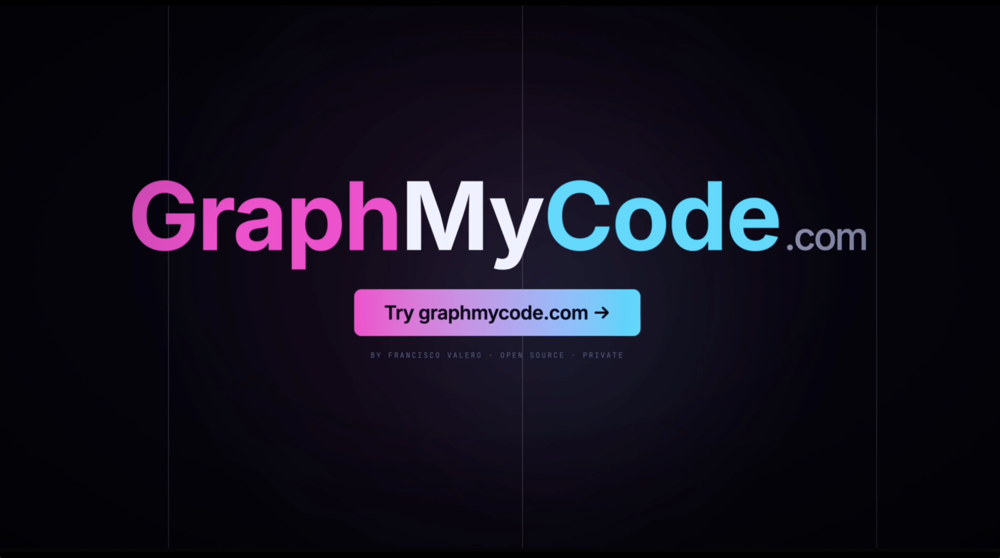

# GraphMyCode


video: https://youtu.be/M9WKj7Hn5m0?si=5U75N80ezUs5-Heg

[](https://polyformproject.org/licenses/noncommercial/1.0.0)

**Visualize your codebase as an interactive knowledge graph — entirely in your browser.**

GraphMyCode parses your source code and renders it as a navigable graph of files, functions, classes, interfaces, and their relationships. No server. No uploads. No account. Everything runs locally using WebAssembly.

🌐 **[graphmycode.com](https://graphmycode.com)**

<video src="https://raw.githubusercontent.com/franciscovaleromartin/graphmycode/main/public/anuncio_GraphMyCode_en.mp4" controls width="100%"></video>

---

## Five views

### 🕸️ Structural
Interactive graph of files, classes, functions, imports, and call relationships. Answer questions like:
- What does this file import?
- Who calls this function?
- Which modules are isolated?
- Follow the call stack easily

### 🧠 Semantic 3D
Groups nodes by code similarity using embeddings — regardless of folder structure. Useful for:
- Finding duplicated logic
- Detecting modules that do the same thing
- Analyzing the real impact of a change beyond direct dependencies

### 🏙️ Technical Debt City
Renders the repository as a 3D city. Each node is a building grouped by folder. The taller the building in its district, the more technical debt. Helps you:
- Identify the hardest files to change
- Find the most coupled code
- Decide what to refactor first

### 🔥 Dependency Heatmap
Shows real coupling between files. Bidirectional dependencies appear as orange edges, revealing:
- Import cycles
- Circularly coupled modules
- Spaghetti code at a glance

### ⚡ Code Flow
Renders the internal execution flow of a single file as a directed flowchart. Each node represents a function, method, class, decision branch, loop, or error handler. Useful for:
- Tracing how execution moves through a file
- Seeing which functions call each other
- Locating every `if`, loop, and `try/catch` at a glance
- Exporting the full flowchart as SVG

---

## CLI — visualize any project in one command

```bash
npx graphmycode
```

Run this inside any project directory. GraphMyCode will:

1. Compress your code into a `.zip` (ignoring `node_modules`, `.git`, `dist`, etc.)
2. Start a local server on `127.0.0.1` to serve the zip
3. Open [graphmycode.com](https://graphmycode.com) in your browser and load your code automatically

**Your code never leaves your machine.** The zip is served from your own localhost — the website fetches it locally and processes everything in your browser.

> Requires Node.js ≥ 20. No installation needed with `npx`.

### Examples

```bash
# Visualize the current project
cd ~/projects/my-app
npx graphmycode

# Visualize any directory
cd ~/projects/my-api
npx graphmycode
```

---

## Optional: AI Q&A

Once the graph is loaded, you can connect your own AI provider (OpenAI, Gemini, Anthropic, or Ollama) to ask questions in natural language about your codebase. Your API key is stored only in your browser.

> ⚠️ When using a cloud AI provider, parts of your code will be sent to that provider. Use Ollama to keep everything local.

---

## Languages supported

JavaScript, TypeScript, Python, Java, Go, Rust, C, C++, C#, PHP, Ruby, Swift

---

## Tech stack

| Layer | Technology |
|---|---|
| Frontend | React 18, TypeScript, Vite |
| Styling | Tailwind CSS v4 |
| Graph rendering (2D) | Sigma.js + Graphology + ForceAtlas2 |
| Graph rendering (3D) | Three.js / React Three Fiber |
| Heatmap | Canvas 2D + graphology-layout-noverlap |
| Code parsing | web-tree-sitter (WASM) |
| Semantic embeddings | @huggingface/transformers (WASM) |
| Community detection | Leiden algorithm |
| Dimensionality reduction | UMAP |

---

## Author

Built by [Francisco Valero](https://github.com/franciscovaleromartin).

---

## License

Copyright (C) 2026 Francisco Valero.

This project is licensed under the [PolyForm Noncommercial License 1.0.0](LICENSE). Free for personal, educational, and non-commercial use. Commercial use is not permitted.

The `gitnexus-shared` dependency is also licensed under PolyForm Noncommercial (© Abhigyan Patwari).
